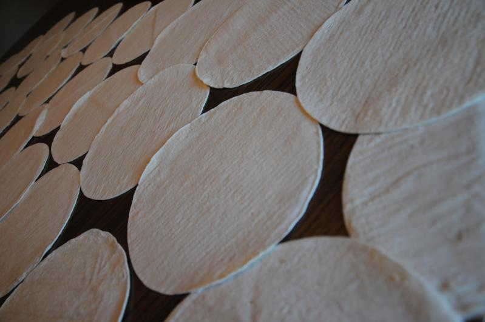

En las tardes, cuando los niños llegan de la escuela y los adultos del trabajo, los hornos comienzan a expulsar una plana y redonda masa de maíz con textura húmeda y cocida, lista para enrollarse e invadir el paladar mexicano. Uno, dos, tres o hasta más kilos de tortilla se reparten a diario en México para sazonar los alimentos cotidianos de cada familia. Sin embargo, las productoras utilizan harina para crear este condimento, mismo que carece de un alto valor nutrimental para el consumo humano, provocando una problemática en el país.

A raíz de este panorama, en la Ciudad de México, abrió sus puertas Cmaíz, una empresa fundada por Irving Rubí, Oscar Méndez, Cristina Rivero, que pretende producir tortillas de maíz con el tradicional proceso de la nixtamalización y la innovación biotecnológica para llevar su producto a los centros comerciales, restaurantes, cocinas y hogares a lo largo de la República mexicana.

El principal objetivo del proyecto es innovar de manera tecnológica, social y sustentable la producción del maíz y sus derivados; así como la investigación y formulación de productos con base en este recurso natural. Para los socios, esta es una forma de implementar la falta de nutrientes en las tortillas y transformar los fracasos que porta esta industria con la creación de productos orgánicos, al mismo tiempo que otorgar oportunidades de empleo.

## Cambio climático, una crisis constante

Una servilleta envuelve entre sus telas algunos discos comestibles, uno encima de otro,  que reposan en el centro del altar de la comida. El calor natural que brota del centro de la mesa y que fluye en el aire tras salir de su ruidosa línea de producción en la colonia Leyes de Reforma, provoca que el reconfortante aroma se manifieste en la masa, persuada al apetito e incite una sensación de devorar al instante el manjar.

La visita diaria de este complemento funge como el perfecto compañero de cualquier platillo, mismo que se convierte en el principal alimento en México a causa de su contexto histórico y el alto valor nutrimental que aporta al organismo por su calcio, potasio y fibra; así como las cantidades de contenido calórico y proteico que la conforman.

Desde su llegada a las cocinas, se consumen aproximadamente 12.3 millones de toneladas de maíz en forma de tortilla en México, donde el 64% de las productoras utiliza el convencional método maíz-masa-tortilla; mientras que el 36% opta por la industria harinera. A pesar de la cifras, son contados los centros de producción de masa que aplican la técnica nixtamal en la elaboración de las mismas, según la revista digital AltoNive.

Al evitar el proceso de la nixtamalización, afecta a la calidad de la masa. Esta problemática radica por el cambio climático, la migración de agricultores y una manufactura deficiente y ambigua que incitan el desarrollo de cultivos sin una seguridad alimentaria; estimulando una importación del 47% de maíz en países extranjeros y degradando económica y socialmente a la agricultura de la nación, de acuerdo con datos del Grupo Consultor de Mercados Agrícolas de México.

Al tomar una tortilla, enrollarla e ingerirla, se desconoce que proviene de una importación y que es, en su mayoría,  transgénicas, las cuales solo funcionan para el consumo de la población. Esto ha generado que pocos agricultores opten por la conservación y mejoramiento de las semillas de maíz nativas que se han perdido con el tiempo y que carecen de recursos para su tratamiento y conservación por la crisis constante de clima; lo que repercute en este negocio.

Tras continuar con un deficiente patrón de cultivo, donde se planta la semilla sin investigar ni aportar soluciones que disminuyan la contaminación del planeta, se persuade a que el único recurso para su cosecha sean los fertilizantes en vez de biofertilizantes. Si se utiliza el segundo recurso, se procesan antibióticos naturales con base en organismos vivos,  estos evitan una contaminación microbiana y promueven una elaboración orgánica sin dañar ni contaminar los suelos.

Cuando Irving, Oscar y Cristina se dieron cuenta de que existían pocos establecimientos para presentar alimentos de buena calidad y que carecen de técnicas de cultivo, decidieron empezar a tejer desde la biotecnología productos a base de maíz. Es así como su iniciativa nació para brindar insumos utilizando métodos de biorremediación que proporcionen un control en el impacto ambiental y satisfaga las necesidades económicas, políticas y sociales que el país y el pueblo mexicano necesita.

## De masa a tortilla: la biotecnología como reivindicación del maíz

Cuando el reloj marca el mediodía y las manecillas continúan señalando los segundos hasta el atardecer, los mexicanos acuden a su tortillería más cercana para adquirir la masa sagrada: la tortilla. Las hileras de personas invaden el establecimiento y encuentran razón de existencia; pues esta no puede faltar en el platillo diario. Cada tortillería crea y vende harina de maíz, aunque este proceso resulta práctico y barato, ocasiona que las propiedades nutricionales no formen parte de la masa.

Es allí donde Cristina Rivero, estudiante de biotecnología en la Universidad Anáhuac, dirige, coordina y utiliza su rama de estudio para crear espacios seguros, en los que la ciencia moldea los principales compuestos del maíz de esta gran red de cultivo, con el objetivo de establecer protocolos de salud con sus respectivos nutrientes que carece la masa.

La biotecnología utiliza diferentes organismos, o de sus derivados, para producir nuevos productos o mejorar los procesos que ya se tienen. Dichos microorganismos junto con organismos vivos, ayudan a perfeccionar los alimentos y sus procesos industriales sin recurrir a la síntesis química para generar el producto alimentario.

La idea de compartir está inserta en su negocio, surge del desarrollo de una tortilla de forma ancestral. A pesar de ser la principal tesis del proyecto, los emprendedores mexicanos no solo pretenden elaborar comida, sino recrear los campos y mejorar los cultivos con la biotecnología, debido a los cambios climáticos y a las sequías que el país ha tenido, a tal grado de que México hoy en día importa en vez de producir.

“El maíz que se importa en México es transgénico y viene principalmente de Estados Unidos, lo cual disminuye los empleos en esta rama. No se da el apoyo suficiente para los campos mexicanos y la solución que nosotros proponemos es implementar investigación en el desarrollo de maíces híbridos con el mismo maíz criollo que otorga el país”, comentó Cristina, principal colaboradora de Cmaíz.

La propuesta principal que Cristina expuso fue que, al exponer las semillas criollas a los cambios climáticos, se volverán resistentes de una manera natural y comenzarán a mutar una variabilidad genética, ocasionando que porten características más fuertes o de resistencia entre los maíces para otorgar la vitamina B3 que solo una buena tortilla porta.

“Hasta el momento, México tiene alrededor de 64 especies de maíz criollo, que se pierden por no incentivar las nuevas técnicas de cultivo, ya que con el tiempo desaparecen porque las condiciones climáticas están en constante cambio y una especie biológica siempre se está adaptando a su ambiente. Si estos maíces no se empiezan a exponer al medio adverso o estresante del país, se van a extinguir”, comentó.

## “Sin maíz, no hay país”: la innovación y reinvención del maíz mexicano

Cmaíz está centrada en engrandecer el símbolo y la tradición más antigua de la cocina mexicana, con una elaboración que respeta tradición, sabor y calidad; por lo que promueve tres principales ideas de innovación de este producto: la hibridación de semillas por regiones, el uso del totomoxtle para la elaboración de bioplásticos; así como el uso del nejayote como bio-polielectrolito.

Pretende realizar hibridaciones derivadas de las distintas semillas que se cultivan en una zona en específico de México , lo que permite conservar su variabilidad genética por más tiempo, así como del mejoramiento de la especie, su rendimiento, valor nutricional y combinación de caracteres únicos, con tal de brindar un valor nutricional adecuado en la tortilla.

Al obtener su semilla, la intención de la empresa mexicana es producir tortillas a partir de la nixtamalización, la cual consiste en la cocción del grano de maíz junto con una solución de hidróxido de calcio que hidrate el grano con las proteínas y paredes celulares para gelatinizar parcialmente el almidón. Durante la cocción, el maíz absorberá el calcio y potasio para obtener los nutrientes necesarios.

Al emplear este desarrollo, también permite descontaminar los granos y añadir aminoácidos que el cuerpo humano no puede producir por sí mismo. Por lo tanto, una tortilla hecha por Cmaíz tendrá mejor consistencia, será más nutritiva y se cocerá con facilidad, brindando la sensación de ingerir masa recién cocida del comal hasta el cielo de la boca.

Luego de aplicar este proceso, se obtienen aguas residuales, mejor conocidas como Nejayote, las cuales son altamente corrosivas debido a su pH y que sirven como un compuesto orgánico para el tratamiento previo en la producción de tortillas y el riego de sus cultivos y plantas.

El nejayote incrementará su elaboración y fungirá como fertilizantes de los cultivos para mejorar la biodisponibilidad de nutrientes e incrementar la absorción de los mismos en la tolerancia al estrés abiótico. Este punto puede contribuir y formar parte de una economía circular que permita reducir el impacto ambiental y mejorar los cultivos, generando un mayor número de empleos con las nuevas técnicas de siembra y control biológico de las tierras mexicanas.

[Pueden leer el artículo original en inglés haciendo click aquí](https://www.fairplanet.org/op-ed/cmaiz-the-shining-of-mexican-tortilla/)
